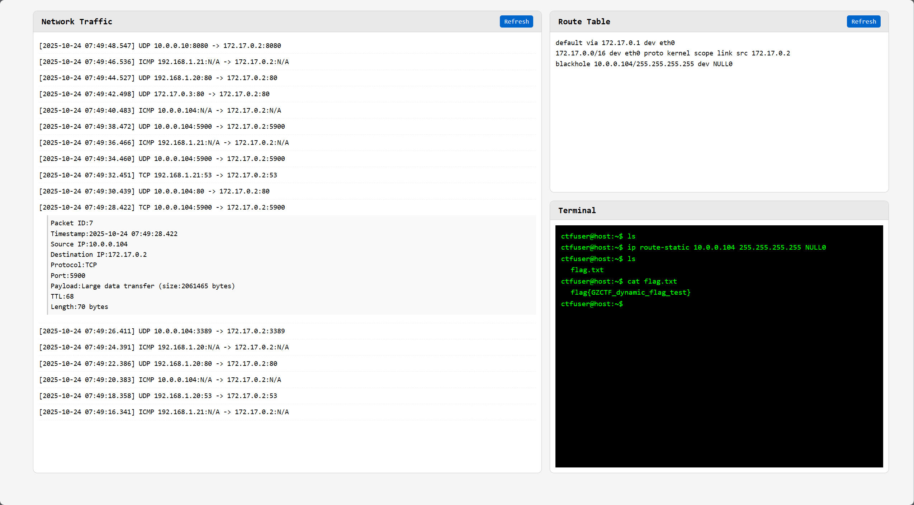
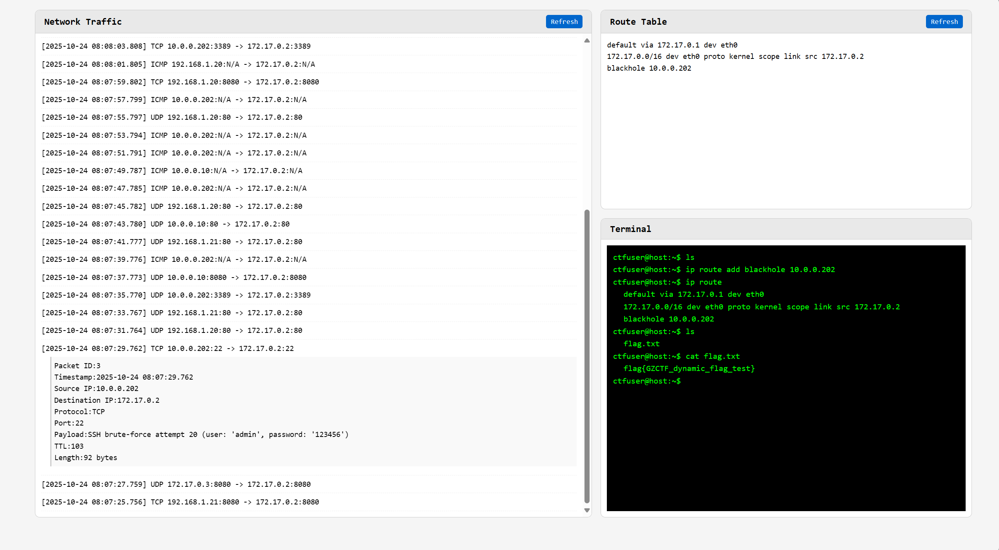

# blackhole_routing-web

1. 找到那个 IP 发送了大量数据，或者找到那个 IP 在访问 22 端口尝试 SSH 登录
2. 在终端界面输入 `ip route add blackhole <异常IP>` 或 `ip route-static <异常IP> 255.255.255.255 NULL0` 封禁 IP
3. 在终端输入 `ls` 知道生成了 `flag.txt`，然后 `cat flag.txt` 得到 `flag`

