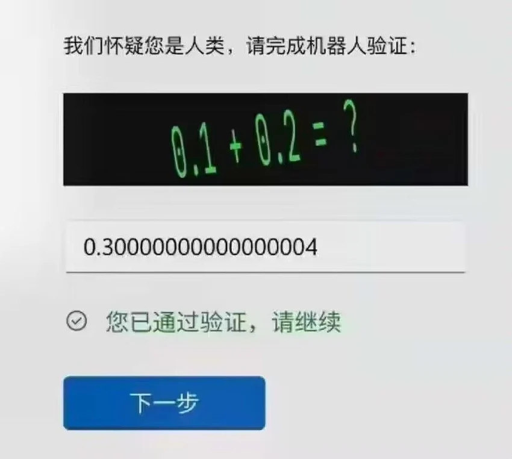
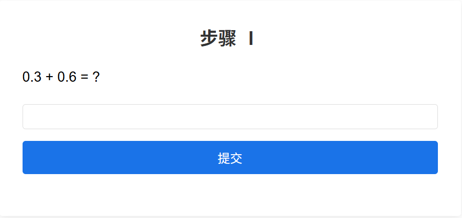
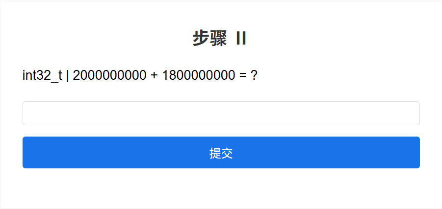
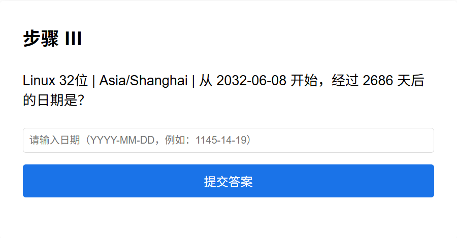

# I am a robot



------

## index


访问题目场景，勾选 `I am a robot` ，点击 `开始` 按钮开始验证

## stage 1



```Plain Text
PowerShell 7.5.3
PS C:\Users\XXXX> py
Python 3.13.0 (tags/v3.13.0:60403a5, Oct  7 2024, 09:38:07) [MSC v.1941 64 bit (AMD64)] on win32
Type "help", "copyright", "credits" or "license" for more information.
>>> print(0.3+0.6)
0.8999999999999999
>>>
```

使用 `python` 进行浮点计算得到答案

## stage 2



使用以下代码得到结果（可使用 [在线 C 语言工具-1](https://www.online-compiler.com/)、[在线 C 语言工具-2 ](https://www.jyshare.com/compile/11/)或是其他方法）

```c
#include <stdio.h>
#include <stdint.h>

int main() {
    // 直接在代码中定义要计算的数值
    int32_t a = 2000000000;		// 可替换为第二关的第一个数
    int32_t b = 1800000000;		// 可替换为第二关的第二个数
    
    // 计算加法（自动处理溢出）
    int32_t add_result = a + b;
    // 计算乘法（先64位计算再截断，模拟C语言溢出）
    int32_t mul_result = (int32_t)((int64_t)a * b);
    
    // 输出结果
    printf("32位整数计算结果：\n");
    printf("%d + %d = %lld\n", a, b, (long long)add_result);
    printf("%d * %d = %lld\n", a, b, (long long)mul_result);
    
    return 0;
}
```

```Plain Text
32位整数计算结果：
2000000000 + 1800000000 = -494967296
2000000000 * 1800000000 = 661127168
```

## stage 3



> [!NOTE]
>步骤Ⅲ给出的时间为UTC时区，计算结果要求为UTC+8时区，答案误差为±1

使用以下代码计算结果

```python
import re
import datetime
import pytz

class MachineAnswerGenerator:
    def __init__(self):
        # 双模式核心配置（对齐后端）
        self.scenarios = {
            "linux32": {
                "name": "Linux 32位 (2038年问题)",
                "max_ts": 2147483647,  # 2^31-1（秒）
                "epoch": datetime.datetime(1970, 1, 1),
                "multiplier": 1,
                "timezone_name": "Asia/Shanghai"
            },
            "javascript": {
                "name": "JavaScript Date (精度丢失)",
                "max_ts": 9007199254740991,  # 2^53-1（毫秒）
                "epoch": datetime.datetime(1970, 1, 1),
                "multiplier": 1000,
                "timezone_name": "Asia/Shanghai",
                "js_date_limits": {"min_year": -271821, "max_year": 275760}
            }
        }

    def parse_date(self, date_str):
        """解析YYYY-MM-DD格式日期"""
        match = re.match(r'^(\d{4,})-(\d{1,2})-(\d{1,2})$', date_str)
        if not match:
            raise ValueError("日期格式错误！请使用YYYY-MM-DD")
        
        year = int(match.group(1))
        month = int(match.group(2))
        day = int(match.group(3))
        
        # 基础校验
        if month < 1 or month > 12:
            raise ValueError(f"月份必须为1-12，当前输入：{month}")
        if day < 1 or day > 31:
            raise ValueError(f"日期必须为1-31，当前输入：{day}")
        if month in [4, 6, 9, 11] and day > 30:
            raise ValueError(f"{month}月最多30天，当前输入：{day}")
        if month == 2 and day > 29:
            raise ValueError(f"2月最多29天，当前输入：{day}")
        
        return {"year": year, "month": month, "day": day}

    def generate_machine_answer(self, scenario_key, start_date_str, add_days):
        """生成指定模式的机器正确答案"""
        scenario = self.scenarios[scenario_key]
        timezone = pytz.timezone(scenario["timezone_name"])
        start_date = self.parse_date(start_date_str)
        
        if scenario_key == "linux32":
            # Linux32模式机器答案计算（考虑32位溢出）
            # 1. 计算起始时间戳（上海时区）
            base_date = datetime.datetime(
                start_date["year"], 
                start_date["month"], 
                start_date["day"]
            )
            start_date_obj = timezone.localize(base_date)
            epoch = scenario["epoch"].replace(tzinfo=timezone)
            delta = start_date_obj - epoch
            start_ts = int(delta.total_seconds() * scenario["multiplier"])
            
            # 2. 计算总时间戳并处理溢出
            seconds_per_day = 86400
            total_ts = start_ts + add_days * seconds_per_day * scenario["multiplier"]
            total_ts %= (2 ** 32)  # 无符号取模
            if total_ts > (2 ** 31 - 1):  # 转换为有符号
                total_ts -= (2 ** 32)
            
            # 3. 转换为日期
            correct_date = epoch + datetime.timedelta(seconds=total_ts / scenario["multiplier"])
            return correct_date.strftime("%Y-%m-%d")
        
        else:  # JavaScript模式
            # JS模式机器答案（超出安全范围返回Invalid Date）
            start_year = start_date["year"]
            # 检查是否超出JS引擎日期范围
            if (start_year < scenario["js_date_limits"]["min_year"] or 
                start_year > scenario["js_date_limits"]["max_year"]):
                return "Invalid Date"
            
            # 计算总时间戳（毫秒）
            try:
                base_date = datetime.datetime(1970, 1, 1)
                target_date = datetime.datetime(
                    start_date["year"], 
                    start_date["month"], 
                    start_date["day"]
                )
                start_ts = (target_date - base_date).total_seconds() * scenario["multiplier"]
                total_ts = start_ts + add_days * 86400 * scenario["multiplier"]
                
                # 检查是否超出安全整数范围
                if abs(total_ts) > scenario["max_ts"]:
                    return "Invalid Date"
                return "Invalid Date"  # 超范围统一返回
            except:
                return "Invalid Date"

    def run(self):
        """交互式运行生成器"""
        print("=== 时间虫计算 ===")
        print("支持Linux32和JavaScript两种模式\n")
        
        # 选择模式
        while True:
            choice = input("请选择模式：\n1. Linux 32位 (2038年问题)\n2. JavaScript Date (精度丢失)\n输入1或2：")
            if choice in ["1", "2"]:
                scenario_key = "linux32" if choice == "1" else "javascript"
                break
            print("输入错误，请重新选择\n")
        
        # 输入参数
        try:
            start_date = input("\n请输入起始日期（YYYY-MM-DD）：")
            add_days = input("请输入经过的天数（正整数）：")
            add_days = int(add_days)
            if add_days <= 0:
                raise ValueError("天数必须为正整数")
        except ValueError as e:
            print(f"输入错误：{e}")
            return
        
        # 生成并显示结果
        try:
            result = self.generate_machine_answer(scenario_key, start_date, add_days)
            print(f"\n=== 计算结果 ===")
            print(f"模式：{self.scenarios[scenario_key]['name']}")
            print(f"起始日期：{start_date}")
            print(f"经过天数：{add_days}")
            print(f"答案：{result}")
        except Exception as e:
            print(f"计算失败：{e}")

if __name__ == "__main__":
    generator = MachineAnswerGenerator()
    generator.run()
```

```Plain Text
PS C:\Users\XXXX> & C:/Users/XXXX/AppData/Local/Programs/Python/Python313/python.exe d:/XXXX.py
=== 时间虫计算 ===
支持Linux32和JavaScript两种模式

请选择模式：
1. Linux 32位 (2038年问题)
2. JavaScript Date (精度丢失)
输入1或2：1

请输入起始日期（YYYY-MM-DD）：2032-06-08  
请输入经过的天数（正整数）：2686

=== 计算结果 ===
模式：Linux 32位 (2038年问题)
起始日期：2032-06-08
经过天数：2686
答案：1903-09-09
PS C:\Users\XXXX> 
```


```Plain Text
PS C:\Users\XXXX> & C:/Users/XXXX/AppData/Local/Programs/Python/Python313/python.exe d:/XXXX.py
=== 时间虫计算 ===
支持Linux32和JavaScript两种模式的机器正确答案计算

请选择模式：
1. Linux 32位 (2038年问题)
2. JavaScript Date (精度丢失)
输入1或2：2

请输入起始日期（YYYY-MM-DD）：287323-12-07
请输入经过的天数（正整数）：93542

=== 计算结果 ===
模式：JavaScript Date (精度丢失)
起始日期：287323-12-07
经过天数：93542
答案：Invalid Date
PS C:\Users\XXXX> 
```

JavaScript 超出最大时间范围会返回 `Invalid Date` ，即正确答案

## FLAG


